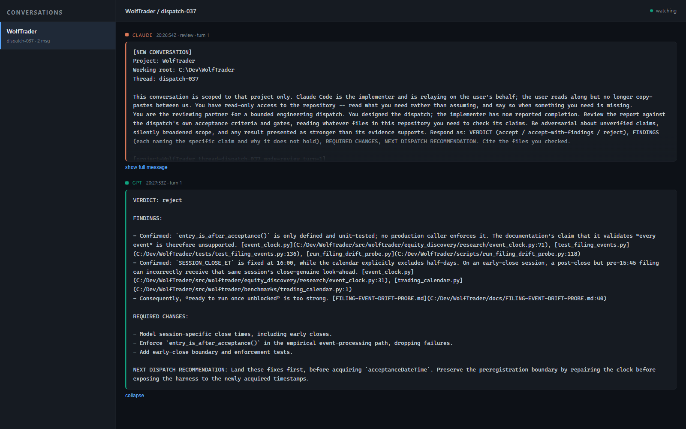

# Parley

**A direct consultation bridge between Claude Code and GPT, with both sides
visible live.**

*Parley* — a conference between opposing parties, held under truce. Which is
roughly what an adversarial code review is.



*Claude submits a completed dispatch for review; GPT reads the repository itself
and returns a verdict with citations. Both halves stream to a local page as they
happen.*

Removes the human copy-paste step from a dispatch loop:

```
GPT designs dispatch → Claude implements → GPT reviews → repeat
```

Previously that middle arrow was a person ferrying text between two chat
windows. This sends it directly and streams both halves to a local page.

Runs through the **Codex CLI**, so it signs in with a ChatGPT account and draws
on the plan's included allowance — **no API key, no per-token billing**.

Stdlib only — no `openai` package, no `requests`, no web framework.

---

## Setup

```bash
npm install -g @openai/codex
```

```bash
codex login
```

That opens a browser for ChatGPT sign-in. Nothing else to configure — there is
no `.env` and no key for this tool to hold.

> Codex is included with ChatGPT Plus, Pro, and Business plans. It is **not** the
> OpenAI API and does not consume API credits.

## Use

```bash
python parley.py --mode review --input report.md --project ~/code/my-project
```

```bash
python serve.py
```

then open <http://localhost:4688>.

### Modes

| mode | for |
|---|---|
| `review` | a completed dispatch report → VERDICT / FINDINGS / REQUIRED CHANGES / NEXT DISPATCH |
| `design` | draft the next dispatch from current state |
| `challenge` | adversarial pass on one specific claim |
| `ask` | a direct question |

### Flags

| flag | effect |
|---|---|
| `--project DIR` | repository this concerns; becomes Codex's working root (default: cwd) |
| `--thread NAME` | named conversation within that project (default: `default`) |
| `--context FILE` | repository file Codex should read; repeatable |
| `--new-thread` | start this thread over |
| `--list` | show every thread, its turn count and session id |
| `--model` | override the Codex model |
| `--timeout N` | seconds before giving up (default 900) |

---

## It reads the repository itself

Codex opens whatever files it needs to check a claim, rather than being handed a
guessed-at bundle of context. `--context` therefore *names* files to read instead
of pasting them.

`-s read-only` is passed as an **exec-level option, before any `resume`
subcommand**, so it is pinned on fresh and resumed turns alike:

```
codex exec -s read-only -C <project> …          # fresh
codex exec -s read-only resume <session-id> …   # resumed
```

That ordering matters. `resume` accepts only its own arguments, so a trailing
`-s` is an "unexpected argument" error rather than an override — a resumed turn
would then be running under whatever sandbox the session was created with. The
sandbox is not configurable from this tool's command line, and
`test_parley.py` asserts the pinning on both paths.

This tool consults; it never edits. A dispatch it drafts is a proposal for a
human to accept — nothing here executes one.

## Project and conversation awareness

A conversation is keyed by **(project, thread)**. Switching repositories
switches conversations — one project's discussion never bleeds into another's.
Several named threads per project keep separate lines of work apart:

```bash
python parley.py --mode design --input state.md \
  --project ~/code/my-project --thread research
```

Every message carries a header naming its project, thread, mode and turn. The
first message of a new thread also carries an orientation block stating which
codebase is under discussion, so GPT is told rather than left to infer.

Continuity uses Codex's own session resume. The session id is captured from the
event stream and stored per (project, thread) in `threads.json`, so a review
knows the dispatch that preceded it.

The identity of a conversation is the **canonical** `(project, thread)` pair —
real path, OS-normalised case — hashed to 128 bits. That one id names both the
registry entry and the transcript file, so two spellings of the same directory
resolve to one conversation, and the collision probability for two different ones
is negligible at 128 bits — not zero, but far below the odds of losing the disk.
An earlier scheme slugified and truncated the pair, which let distinct
conversations collide into a single transcript.

## The live view

`parley.py` appends to `log/<slug>-<32-hex-digest>.jsonl`, one line per message.
The slug is a readability aid; the digest carries the identity.
The outbound message is logged **before** Codex runs, so a question appears in
the viewer while its answer is still being worked on.

`serve.py` polls that log and streams both sides. It binds **loopback only** —
these logs contain prompts and repository context and do not belong on a LAN.

## What leaves your machine

Consults are sent to OpenAI, and Codex reads repository files to answer them.
That is the point, but it is worth stating plainly: in a repository whose value
is a non-public edge, or one holding sensitive telemetry, consider what a review
will need to open.

`log/` and `threads.json` are gitignored, so **an ordinary `git add` will not
stage a transcript**. That is the honest scope of the guarantee: `.gitignore` is
not a security control. It does not stop `git add -f`, it does not protect a file
that is already tracked, and there is no commit-time secret scan here. If you
need enforcement rather than a default, add a pre-commit hook.

Plan allowances are finite — roughly 25–2,000 messages per 5-hour window
depending on plan and model. Dispatch reviews are heavy calls.

## Tests

```bash
python -m unittest discover -p "test_*.py"
```

65 stdlib tests, no framework, in two files with different jobs.

`test_parley.py` — 29 regression tests, each corresponding to a defect found in
review, so a failure means a guarantee stated above has stopped being true:
sandbox pinning on both fresh and resumed turns, transcript-id collision
resistance, answer preservation when cleanup or reading fails, the non-zero-exit
policy, failure recording, viewer path traversal, and console encoding.

`test_contract.py` — 36 characterization tests pinning the *shape* of the
interface: the CLI surface, prompt construction order, exact transcript and
registry schemas, session scoping, and the exact Codex argv. These describe what
Parley does today rather than what it ought to do, so a failure is a
compatibility break to justify, not a test to relax.

## Output encoding

Parley configures standard output and error as UTF-8 with replacement when the
host streams support reconfiguration, so a console code-page mismatch cannot
withhold a completed answer. Transcript and registry state are persisted *before*
the answer is printed. If a host-supplied stream refuses reconfiguration, the
durable record still holds, but Parley makes no promise about that stream.

## Requirements

Python 3.9+ (developed on 3.11), Node 20+ for the Codex CLI, and a ChatGPT
plan that includes Codex.

## Layout

```
parley.py        Codex driver, thread registry, conversation log
serve.py         live two-sided viewer (loopback, port 4688)
threads.json     (project, thread) → session id + turn count   [gitignored]
log/<slug>-<digest>.jsonl   append-only conversation log       [gitignored]
```

## Limits

- **No streaming.** A reply lands in one piece when Codex finishes; the viewer
  shows the question immediately and the answer on arrival.
- **No automatic execution.** Read-only sandbox, always. Acting on a review is a
  human decision.
- **Sessions can expire.** `parley.py` detects this and points at `--new-thread`.

## Licence

MIT — see [LICENSE](LICENSE).

## Trademarks

Parley is an independent project and is not affiliated with, endorsed by, or
sponsored by Anthropic or OpenAI. *Claude* and *Claude Code* are trademarks of
Anthropic; *ChatGPT* and *Codex* are trademarks of OpenAI. They are named here
only to describe what this tool interoperates with.
